Tetiana Stroganova
07/07/2019

## Olive Oils Origin Prediction Using Classification Methods

-----

## 1\. Introduction

The food authenticity testing is a valuable tool for consumers
protection. It allows to check the product origin and quality and
prevents any fraudulent manipulations. Recently, several products, such
as wine, fish, olive oil, honey, have been identified by an initiative
of the European Parliament as being the target of fraud.

In this project, we will use the classification methods to predict which
of three geographic regions the olive oil samples come from, based on
the spectroscopic measurements. In spectroscopy, the objects are
represented by a spectrum of radiation measurements or light reflection
from the substance for a range of wavelengths. The challenges of
spectroscopic data are typically the high dimensionality and a high
level of correlation between the measurements taken at neighbouring
wavelengths.

This data set is absorption levels in the near-infrared and infrared
range of the spectrum (ranging from 400nm to 2498nm). It comprises 65
samples of olive oils originating from three regions: Crete, Peloponese
and Other and 101 spectroscopic measurements for each of the samples
(variables from 720 to 820).

## 2\. Data preparation

The data was split into three sets: training set – 50% of the data,
validation and test sets – 25% of the data each.

The proportional split between classes in each of the sets was
respected:

    ##                Crete Other Peloponese
    ## Training set    0.27  0.30       0.42
    ## Validation set  0.29  0.29       0.41
    ## Test set        0.27  0.27       0.47
    ## Full set        0.28  0.29       0.43

## 3\. Exploratory analysis

As there are 101 columns with spectroscopic measurements, it’s quite
difficult to visualize the data. As we can see on the boxplots graph
below, there are some outliers and means vary a lot for different
variables.

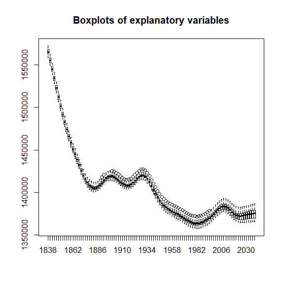

The correlation plot indicates strong positive correlation between a
fair number of
variables:

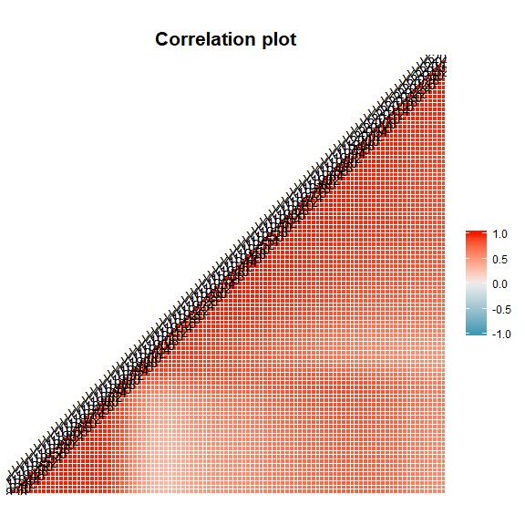
This means that Principal Components Analysis would be useful to reduce
the dimensionality, while keeping the variability of the data. To decide
whether the PCA should be based on covariance or correlation matrix, we
need to see whether the standard deviations vary a lot.

In our training data set, the standard deviations vary from 2354 to
5883, so we will base the PCA on the correlation matrix rather than on
the covariance one.

## 4\. Dimensions reduction – PCA

Our data set contains more variables than observations, therefore
prcomp() function needs be used for PCA, the scale needs to be set to
TRUE to perform the analysis based on the correlation matrix. As a rule
of thumb, we will aim to keep at least 95% of variability of the data,
and the method of cumulative variability will be used to decide how many
PCs will be kept.

As per the results of the PCA below, the first two components allow us
to keep 92.9% of variability in data, whereas the three components
retain 98.6% of variability in data. Therefore, three first three PCs
should be retained to ensure that at least 95% of variability are kept.

    ## Importance of components:
    ##                           PC1    PC2     PC3     PC4     PC5     PC6
    ## Standard deviation     9.0304 3.5043 2.40512 0.97889 0.46733 0.27376
    ## Proportion of Variance 0.8074 0.1216 0.05727 0.00949 0.00216 0.00074
    ## Cumulative Proportion  0.8074 0.9290 0.98626 0.99575 0.99791 0.99865
    ##                            PC7     PC8     PC9    PC10    PC11    PC12
    ## Standard deviation     0.21811 0.19292 0.13523 0.10380 0.06935 0.05388
    ## Proportion of Variance 0.00047 0.00037 0.00018 0.00011 0.00005 0.00003
    ## Cumulative Proportion  0.99912 0.99949 0.99967 0.99978 0.99983 0.99986
    ##                           PC13    PC14    PC15    PC16    PC17    PC18
    ## Standard deviation     0.04827 0.04630 0.03785 0.03390 0.03240 0.03099
    ## Proportion of Variance 0.00002 0.00002 0.00001 0.00001 0.00001 0.00001
    ## Cumulative Proportion  0.99988 0.99990 0.99991 0.99992 0.99994 0.99994
    ##                           PC19    PC20    PC21    PC22    PC23    PC24
    ## Standard deviation     0.02979 0.02862 0.02582 0.02254 0.02135 0.02005
    ## Proportion of Variance 0.00001 0.00001 0.00001 0.00001 0.00000 0.00000
    ## Cumulative Proportion  0.99995 0.99996 0.99997 0.99997 0.99998 0.99998
    ##                           PC25   PC26    PC27    PC28    PC29    PC30
    ## Standard deviation     0.01858 0.0181 0.01708 0.01602 0.01432 0.01317
    ## Proportion of Variance 0.00000 0.0000 0.00000 0.00000 0.00000 0.00000
    ## Cumulative Proportion  0.99999 1.0000 0.99999 0.99999 1.00000 1.00000
    ##                          PC31    PC32      PC33
    ## Standard deviation     0.0116 0.01018 1.822e-13
    ## Proportion of Variance 0.0000 0.00000 0.000e+00
    ## Cumulative Proportion  1.0000 1.00000 1.000e+00

Let’s check if there are any outliers in the first two PCs
space:

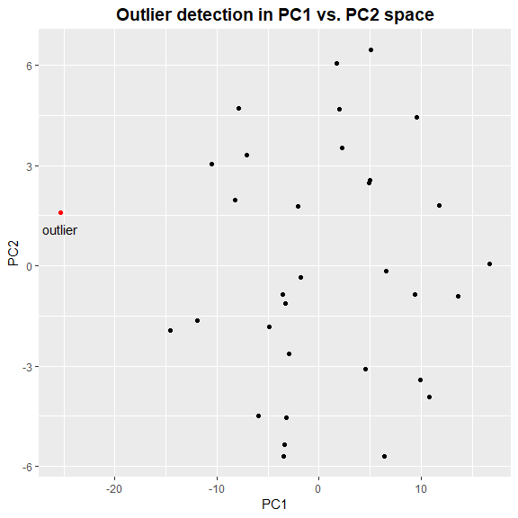

There is one outlier, we’ll exclude it, using the outlier() function and
rerun PCA. As demonstrated on the plot below, there is no more outliers,
so we can keep the second PCA
results.

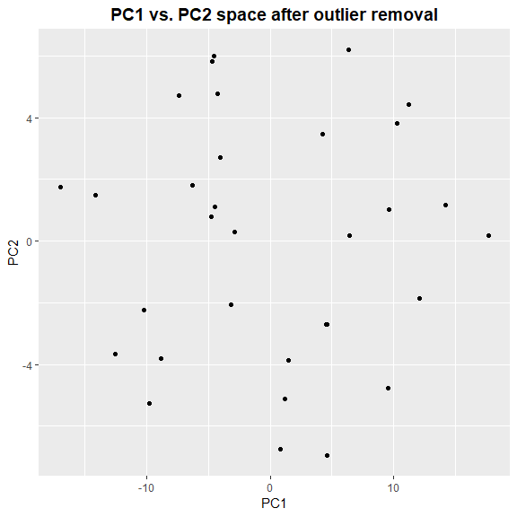

After removing the outlier and rerunning the PCA, the first two PCs
allow us to keep 91.4% and the first three – 98.3%, so the first three
PCs need to be retained.

    ## Importance of components:
    ##                           PC1    PC2     PC3     PC4     PC5     PC6
    ## Standard deviation     8.8021 3.8556 2.64277 1.07132 0.52090 0.29565
    ## Proportion of Variance 0.7671 0.1472 0.06915 0.01136 0.00269 0.00087
    ## Cumulative Proportion  0.7671 0.9143 0.98344 0.99480 0.99749 0.99835
    ##                            PC7     PC8     PC9    PC10    PC11    PC12
    ## Standard deviation     0.24930 0.21375 0.13604 0.11454 0.07875 0.06073
    ## Proportion of Variance 0.00062 0.00045 0.00018 0.00013 0.00006 0.00004
    ## Cumulative Proportion  0.99897 0.99942 0.99960 0.99973 0.99979 0.99983
    ##                           PC13    PC14    PC15    PC16    PC17    PC18
    ## Standard deviation     0.05481 0.04474 0.04205 0.03779 0.03597 0.03512
    ## Proportion of Variance 0.00003 0.00002 0.00002 0.00001 0.00001 0.00001
    ## Cumulative Proportion  0.99986 0.99988 0.99990 0.99991 0.99993 0.99994
    ##                           PC19    PC20    PC21    PC22    PC23    PC24
    ## Standard deviation     0.03256 0.03030 0.02788 0.02490 0.02272 0.02116
    ## Proportion of Variance 0.00001 0.00001 0.00001 0.00001 0.00001 0.00000
    ## Cumulative Proportion  0.99995 0.99996 0.99996 0.99997 0.99998 0.99998
    ##                           PC25    PC26    PC27   PC28    PC29    PC30
    ## Standard deviation     0.02055 0.01992 0.01877 0.0163 0.01553 0.01336
    ## Proportion of Variance 0.00000 0.00000 0.00000 0.0000 0.00000 0.00000
    ## Cumulative Proportion  0.99998 0.99999 0.99999 1.0000 1.00000 1.00000
    ##                           PC31      PC32
    ## Standard deviation     0.01186 5.697e-16
    ## Proportion of Variance 0.00000 0.000e+00
    ## Cumulative Proportion  1.00000 1.000e+00

We can visualize the three classes in the new reduced space, using
fviz\_pca\_ind function from factoextra
library:

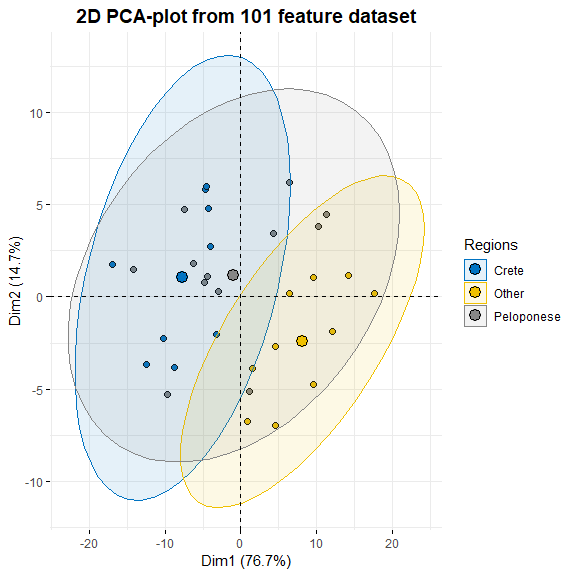

As the goal of the project is classification and the PCA technique is
only used for the dimensionality reduction, we will not discuss the
loadings or scores in detail.

We have obtained the scores for the training set, but we also need to
calculate the corresponding scores for the validation and test sets,
using the function predict.

## 5\. Classification techniques

All the classification techniques below will be applied using the
PCA-transformed data sets. The models will be trained, using the
training set. The prediction will be made, based on the validation set,
using predict() function. The predicting performance will be assessed,
using confusionMatrix() function from caret library.

The parameters we will use to assess the models are the following:

  - Overall accuracy - percentage of correctly classified observations
    across all the classes.

  - Kappa - how the model exceeded random predictions in terms of
    accuracy.

  - Sensitivity - what percentage of the observations in a class were
    correctly classified.

  - Specificity - what percentage of the observations were not predicted
    to be in a certain class when they should not have been predicted.

  - Balanced accuracy - balance between correctly predicting a class and
    correctly not predicting it when it’s not the case, calculated as
    (sensitivity+specificity)/2

## 5.1 k-nearest neighbours

The first classification technique we will use is k-nearest neighbours.
We will use traincontrol() and train() functions from caret library to
find the best model. We will use a “repeatedcv” method in traincontrol()
function. The “repeatedcv” cross-validation method with number set to 10
and repeats set to 3 mean that the training data set will be divided
into 10 parts, and then each of the parts will be used as a test set for
a model trained on the remaining 9. Then the average error is obtained
from these 10 models. In three repeats, we will perform the average of 3
error terms calculated by running 10 fold CV three times. The train
function then selects the best model based on accuracy. In our case, the
best model is the one with k=15.

We can now predict the classes and assess the model, using the
validation data set. The overall accuracy of the model is 64.7% with
no-information rate 41% (this rate will be the same for all models based
on the same data), the Kappa is 44%, so the model performs better than a
simple guess, but the prediction power is still quite poor. It doesn’t
identify the Crete region at all but predicts the Peloponese and Other
classes correctly in 86% and 100% of cases respectively. With regards to
specificity, when we shouldn’t have predicted a class, we didn’t do so
correctly in 100% of cases for Crete, 92% for Other class and 50% for
Peloponese. The balanced accuracy is 50% for Crete, 96% for Other class
and 68% for Peloponese region.

## 5.2 Fully-grown tree and pruned tree

The next technique we will use is classification trees. We will perform
it, using rpart() function from rpart library and rpart.plot() for
visualization.

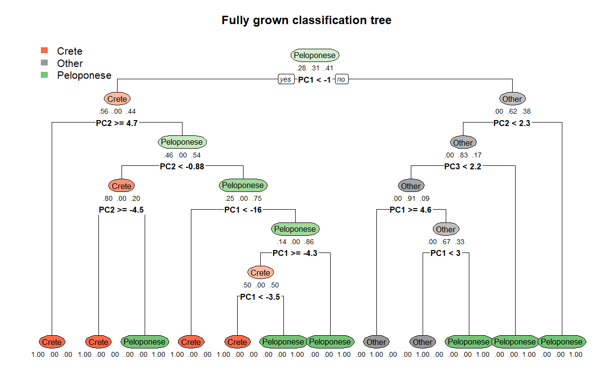

This model gives worse results than the k-nearest neighbours technique:
the overall accuracy is 52.9%, and the Kappa is 27%. The sensitivity is
20% for Crete, 80% for the Other class and 57% for Peloponese region.
Turning now to specificity, it’s equal to 83% for Crete, 92% for the
Other class and 50% for Peloponese.

In order to improve the accuracy of the model, we will try to prune the
tree, using the printcp() function. We will prune, using the cp of the
largest tree that is within one standard deviation of the tree with the
smallest xerror.

    ## 
    ## Classification tree:
    ## rpart(formula = oliveoillabels ~ PC1 + PC2 + PC3, data = final.train.set, 
    ##     method = "class", cp = -1, minsplit = 2, minbucket = 1)
    ## 
    ## Variables actually used in tree construction:
    ## [1] PC1 PC2 PC3
    ## 
    ## Root node error: 19/32 = 0.59375
    ## 
    ## n= 32 
    ## 
    ##          CP nsplit rel error  xerror     xstd
    ## 1  0.315789      0   1.00000 1.47368 0.098465
    ## 2  0.210526      1   0.68421 1.42105 0.108103
    ## 3  0.105263      2   0.47368 0.94737 0.147697
    ## 4  0.052632      4   0.26316 0.84211 0.148865
    ## 5  0.026316      7   0.10526 0.73684 0.147697
    ## 6 -1.000000     11   0.00000 0.73684 0.147697

The smallest xerror is 0.73684, its standard deviation is 0.147697. So,
we will choose the largest tree with xerror less than 0.884537. There
are 3 trees satisfying this rule, we will select the one with less
splits, so the one with cp= 0.052632.

The pruned tree is smaller than the fully grown
one:

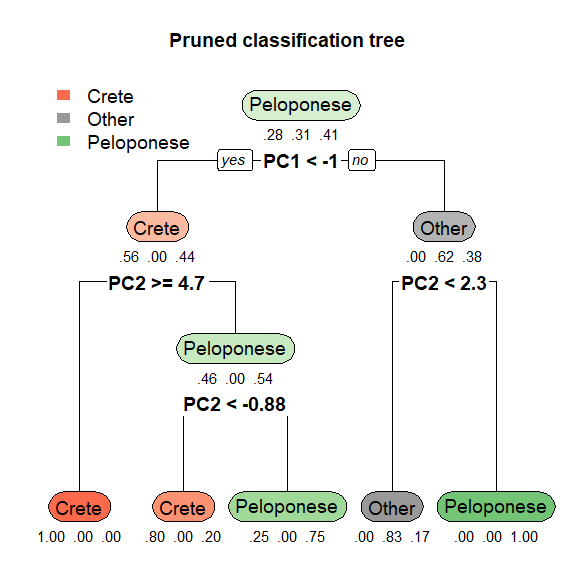

The pruned tree model gives better results in terms of prediction than
the fully grown one: the overall accuracy of the pruned tree model is
64.7% and Kappa - 46%. The sensitivity is 40% for Crete, 100% for Other
class, and 57% for Peloponese region. The specificity is 92% for Crete,
83% for Other class and 70% for Peloponese.

## 5.3 Random forest model

The next model we will use is the random forest. We create it by using
the randomForest() function from the randomForest library.

The performance seems to be similar with the fully-grown tree model in
terms of the overall accuracy at 52.9%, the Kappa is the same at 27%.
The sensitivity and specificity parameters are different from the
fully-grown tree model: the model correctly identifies Crete region in
40% of cases, Other region in 60% of cases and Peloponese region in 57%
of cases. Concerning specificity, the results are following: 83% for
Crete, 92% for Other class and 50% for Peloponese region.

## 5.4 Support vector machines models

Turning to the support vector machines models, three models will be
considered: linear, radial and polynomial. We want to choose the best
model, so we will use tune.svm command to pick the best parameters using
cross-validation on the training data set.

## 5.4.1 Linear SVM

As per the results of tuning the model with different cost parameters
(0.1, 0.5, 1, 2, 5, 10), the best cost parameter for the linear model is
0.5, we will use this model for the prediction on the validation set.

    ## 
    ## Parameter tuning of 'svm':
    ## 
    ## - sampling method: 10-fold cross validation 
    ## 
    ## - best parameters:
    ##  cost
    ##   0.5
    ## 
    ## - best performance: 0.4416667 
    ## 
    ## - Detailed performance results:
    ##   cost     error dispersion
    ## 1  0.1 0.5333333  0.3122993
    ## 2  0.5 0.4416667  0.2292298
    ## 3  1.0 0.4750000  0.2358659
    ## 4  2.0 0.4750000  0.2358659
    ## 5  5.0 0.5666667  0.2881401
    ## 6 10.0 0.6000000  0.3186585

This model offers the best accuracy so far with the overall accuracy at
70.6% and Kappa - 55%. The sensitivity for Crete is 40%, 100% for the
Other class and 71% for Peloponese region. The specificity results are
quite high as well: 92% for Crete and Other class and 70% for Peloponese
region.

The graph below visualizes the classification of linear
SVM:

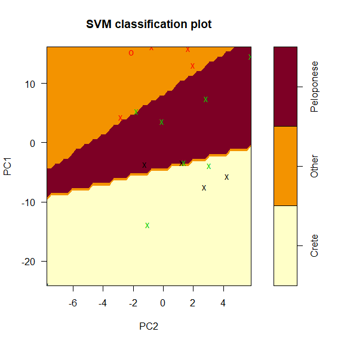

## 5.4.2 Radial SVM

The same cost parameters are used for the radial SVM as the ones we set
for the linear SVM above. An additional parameter to set for the radial
model is gamma, we have chosen the values as follows: (0.5, 1, 2, 3, 4).
As per the results of the tuning, the best cost and gamma parameters for
the radial SVM are 1 and 0.5 respectively.

    ## 
    ## Parameter tuning of 'svm':
    ## 
    ## - sampling method: 10-fold cross validation 
    ## 
    ## - best parameters:
    ##  gamma cost
    ##    0.5    1
    ## 
    ## - best performance: 0.5416667

In terms of the performance, the radial SVM is similar with the pruned
tree model – with the same overall accuracy at 64.7% and a slightly
lower Kappa at 45%. It identifies the Crete class correctly in 20% of
cases, the Other class in 100% of cases and Peloponese region in 71% of
cases. The specificity parameters are 100% for Crete, 83% for Other
class and 60% for Peloponese region. The plot below reflects the
classification using the radial
SVM:

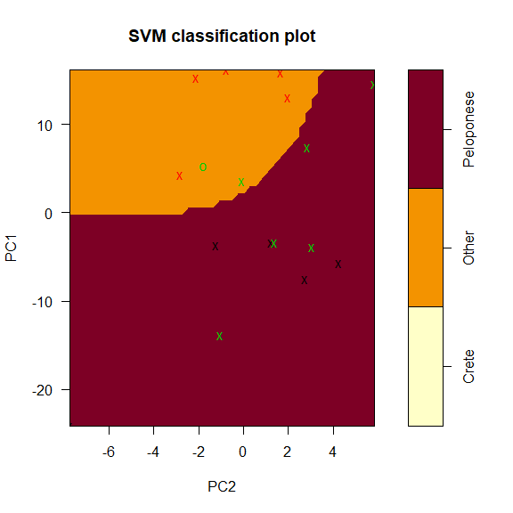

## 5.4.3 Polynomial SVM

The same cost parameters are used for the polynomial SVM as the ones we
set for the linear SVM above. The additional parameters to set for the
radial model are gamma, degree of polynomial and coef0, we have chosen
the values as follows:

  - degree – (2,3),
  - coef0 - (0.5, 1, 2, 3, 4),
  - gamma - (0.5, 1, 2, 3).

As per the tuning results, the best parameters for the polynomial SVM
are the following:

  - degree – 2,
  - gamma – 0.5,
  - coef0 – 1,
  - cost – 0.1.

Concerning the performance of the model, it performs almost as well as
the linear SVM: the overall performance is the same – 70.6%, Kappa is
slightly lower – 54%. The model correctly predicts the Crete, Other and
Peloponese regions in 20%, 100% and 86% of cases respectively. The
specificity coefficients are 100%, 92% and 60% for Crete, Other and
Peloponese regions respectively.

The corresponding classification plot illustrates the boundaries set by
the polynomial
SVM:

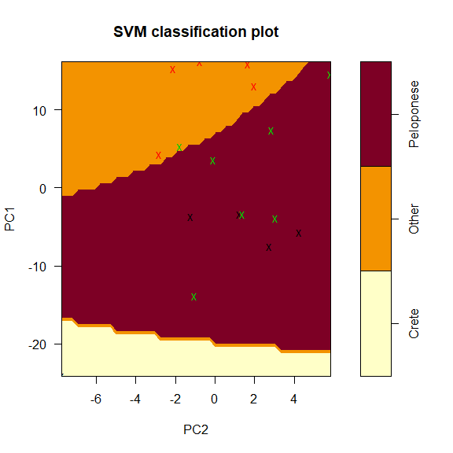

## 6\. Models comparison and selection

We have already discussed the results each model provides us with, based
on the validation data set. Let’s summarise this information and compare
the models in terms of the overall accuracy and the Kappa parameter:

    ##                     Accuracy Kappa
    ## Linear SVM             0.706 0.548
    ## Polynomial SVM         0.706 0.538
    ## Pruned tree            0.647 0.463
    ## Radial SVM             0.647 0.452
    ## K-nearest neigbours    0.647 0.440
    ## Fully-grown tree       0.529 0.269
    ## Random forest          0.529 0.269

The best model in terms of the overall accuracy and Kappa is the linear
SVM, it has the same overall accuracy as the polynomial SVM, but its
Kappa is one point higher. Let’s have a look at the balanced accuracy
parameter for each model as it considers both sensitivity and
specificity of each class:

    ##                     Class: Crete Class: Other Class: Peloponese
    ## Linear SVM                  0.66         0.96              0.71
    ## Polynomial SVM              0.60         0.96              0.73
    ## K-nearest neigbours         0.50         0.96              0.68
    ## Pruned tree                 0.66         0.92              0.64
    ## Radial SVM                  0.60         0.92              0.66
    ## Fully-grown tree            0.52         0.86              0.54
    ## Random forest               0.62         0.76              0.54

As we can see from the table, the linear and polynomial SVMs achieve the
best balanced accuracy for the regions, with the linear SVM performing
slightly better than the polynomial SVM, as it has the highest
percentages overall for both Crete and Other region, and its balanced
accuracy for the Peloponese region is only 2% lower than the result
provided by the polynomial SVM. Based on the above arguments, we will
select the linear SVM as the best performing model.

## 7.Testing

Let’s see how the linear SVM performs when used on the test data set.

The linear SVM predictive performance is much better on the test data
set than it was on the validation one: the overall accuracy of the model
is 86.7% and Kappa is 78%. The model correctly identifies Crete region
in 50% of cases, and both Other and Peloponese region in 100% of cases.
The specificity parameters are high as well: 100% for Crete and Other
region and 75% for Peloponese. Finally, the balanced accuracy of the
regions is 75%, 100% and 88% for Crete, Other and Peloponese regions
respectively. The classification plot demonstrates the boundaries set by
the linear SVM on the test set
space:

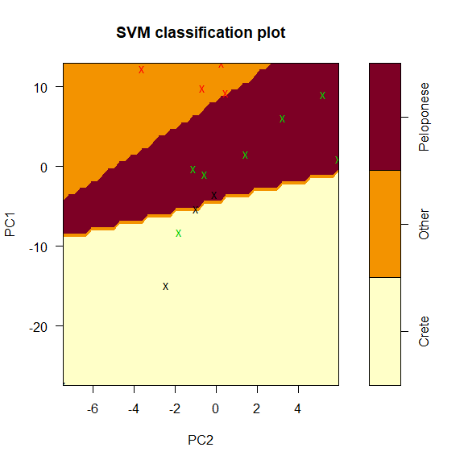

## 8\. Conclusions

We have analysed a data set with 65 samples and 101 spectroscopic
measurements of olive oil originating from three regions: Crete, Other
and Peloponese. Our goal was to create a model identifying the region of
a sample, based on the spectroscopic measurements. The exploratory
analysis has shown that the explanatory variables are strongly
positively correlated, which means that PCA technique could be used to
reduce the dimensionality of the data. As result of PCA, three principal
components have been retained and have allowed us to keep 98% of the
variability in the data.

The following classification techniques have been applied to the
training set: k-nearest neighbours, fully-grown and pruned
classification trees, random forest, and linear, radial and polynomial
SVMs. The comparison of predicting performance, based on the validation
data set, has revealed that the linear SVM has the best predictive
power, therefore it was selected for testing on the final test set. The
performance of the model on the test set has given better results,
compared with the performance based on the validation data: the overall
accuracy is 86.7% which is 16.1% higher than the corresponding figure
calculated for the validation data set.
